<h1 align="center">Trivia Game Night</h1>
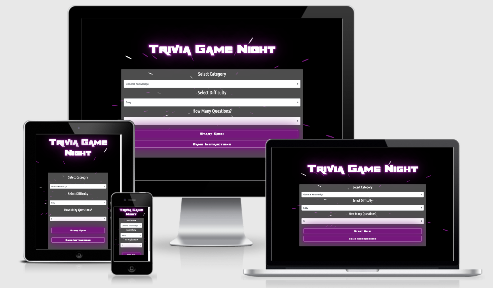 
	
# Table of Contents

* [Purpose](#purpose)
*  [User Experience](#user-experience-ux)
* [Features](#features )
*  [Technologies Used](#technologies-used)
*  [Testing](#testing)
* [Issues Faced](#issues-faced)
* [Known Bugs](#known-bugs)
*  [Future Development](#future-development)
* [Deployment](#deployment)
* [Credits](#credits)

## Purpose 
- A Trivia quiz contains questions about interesting but unimportant questions across many topics. A Trivia Quiz is usually held within social areas such as pubs and bingo halls. This quiz has been designed to bring the same interesting but unimportant questions. The development of this project is for users who would like to test their knowledge across different topics. 

# User Experience (UX)
## Stratergy: 
This project was developed for users to challenge their knowledge in an interactive way. The quizzes importance lies in the fact that it is appropriate for people of all ages and has a wide range of categories to satisfy any user. It also has a range of difficulty levels for those who are more experienced and want to push themselves, as well as, having easier quiz questions for topics you've not delved into before.

The project is based on the [Open Trivia Database](https://opentdb.com/) which essentially is a free to use, user-contributed trivia question database. The Open Trivia Database provides a completely free JSON API to use in programming projects. The use of this API does not require an API Key.

The objective is to provide users with a fun, interactive trivia game based on their favourite categories. Although the game is appropriate for people of all ages, the interface must be visually pleasing to boost user engagement and acceptability across different age groups

-	### User stories
	- As a user, I would like to read instructions for the quiz
	-   As a user, I would like to select a topic that I'm interested in
	-  As a user, I would like to select the number of questions that I want 
	-   As a user, I'd like some control over the quiz difficulty level
	- Once the game has started, I would like each question to be different 
	- Upon selecting an answer I would like to know if I was correct/incorrect
	- At the end of the game, I would like to know my score and given the option to return to the game menu page	
	- As a user, I'd like to be able to play the game on various screen sizes.
	
## Scope:
The quiz pulls data from the Trivia DB using an API. As the API provides over 20 quiz categories, I've amended the list to include 9 popular topics. There were two options for formatting the quiz, multiple-choice or true/false. I decided to go with multiple-choice as I believe it would be more of a viable project to do as there is more development needed. The API can generate a maximum of 50 questions for a given category, I have limited the volume of questions to either 5, 10 and 15.

## Structure:
The **First Section-** Contains the, 3 dropdown options **Category**, **Difficulty** and **Number of questions** and two buttons, one to start the game and another detailing instruction.
The **Second Section-** Contains the questions and potential answers, that are pulled from the API, a section detailing incorrect/correct answers and a quit button.  
The **Third Section-** Contains the Game Over modal, which will display the user's total score and a home button.
## Skeleton:
 Prior to the development of the project, I sketched out in Balsamiq Wireframes to provide an initial idea of how I would display content. My initial wireframe included a timer and progress bar of which I did not implement. The reason for this is that I decided to either display incorrect/correct answers as values rather than implementing a visual bar to display progress. A timer was not included due to time limitations (ironically), however, this is something I have included in [Future Development](#future-development). Find below PDF copies of wireframes below
   -   Pre-development Wireframe - [View](https://github.com/shaff600/TriviaGameNight/blob/master/docs/MS2.pdf)
    -   Post-development Wireframe - [View](https://github.com/shaff600/TriviaGameNight/blob/master/docs/MS2_wireframe%202.pdf)
 ## Surface:
My initial thoughts when designing the surface of the website was to theme the quiz to match an arcade type game. This meant including live backgrounds, funky fonts and a qwerky colour scheme. Here is how i went about achieving this: 
### Live background - [Loading.io](https://loading.io/background/m-interstellar/)
-	The live background was implemented into the site by using an SVG file. By including this, the website can be seen as being arcade-themed as the background is popular for 80's arcade games. 
### Custom Font - [Font Space](https://www.fontspace.com/rapier-zero-font-f18156)
- To suit the 80's arcade theme, I believe this font provides a "loud" styling that suits the theme of the quiz.
### Font Glow - [Code Pen](https://codepen.io/AllThingsSmitty/pen/VzXrgY)
- To exaggerate the "loud" styling, I have also included a glow to the font. the above snippet was used to implement this effect.

### Colour Palette - [Coolors Palette](https://coolors.co/ffffff-800080-000000)
-	Prior to applying a colour scheme to the project, I created a palette on the above site to figure out if the colours will work together.


## Features
-   Integrated connectivity to the Trivia Open Database with the use of an API.
-   Responsive on all device sizes.
- Several quiz topics to choose from.
- Score System.
## Technologies Used

### Languages Used

 1. HTML 
 2. CSS 
 3. Bootstrap  
 4.  JavaScipt
 

### Frameworks, Libraries & Programs Used

1. [Bootstrap 4.4.1:](https://getbootstrap.com/docs/4.4/getting-started/introduction/)
  - Bootstrap was used to assist with the responsiveness and styling of the website.

2. [Google Fonts:](https://fonts.google.com/)
  - Google fonts were used to import the 'Ubuntu Condensed' font into the style.css file which is used on all pages throughout the project.
3. [Font Awesome:](https://fontawesome.com/)
  - Font Awesome was used on all pages throughout the website to add icons for aesthetic and UX purposes.
4. [jQuery:](https://jquery.com/)
  - jQuery came with Bootstrap to aid the frameworks interactive features.
5. [Git](https://git-scm.com/)
  - Git was used for version control by utilizing the Gitpod terminal to commit to Git and Push to GitHub.
6. [GitHub:](https://github.com/)
  - GitHub is used to store the project's code after being pushed from Git.

7. [Balsamiq:](https://balsamiq.com/)
  - Balsamiq was used to create the [wireframes](https://github.com/) during the design process.

# Testing

The W3C Markup Validator and W3C CSS Validator Services and JSLint were used to validate every page of the project to ensure there were no syntax errors in the project.
	
- [W3C HTML Validator](https://validator.w3.org/)
- When running my index.html file through the validator there were 4 errors that were outputted. As seen here:
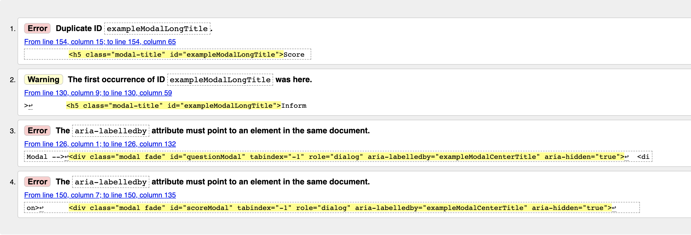
	-	Fix: There were two error/warning relating to duplication of ids. This was rectified by removing the ids entirely. Furthermore, the "aria-labelledby" was removed as it is not needed. Both issues were caused by inserting code from the Bootstrap Docs and not removing elements that aren't needed. 

-	 [W3C CSS Validator](https://jigsaw.w3.org/css-validator/)
	-	The validator produced 8 errors, 7 are related to the transparent background and 1 is related to a typo. Error's can be seen here: 
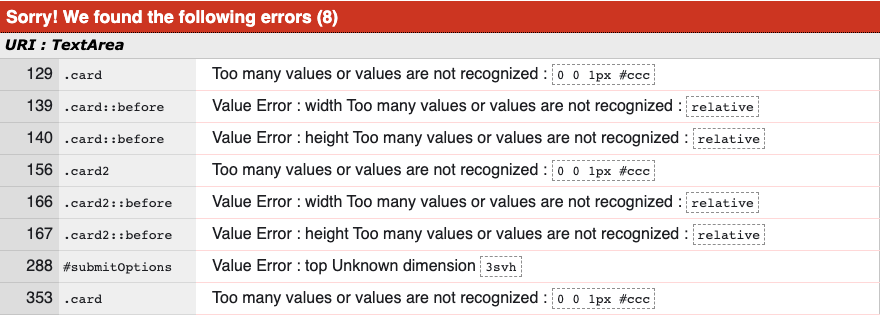
		-	Fix: I've removed the values that were causing issues. The transparency background was developed using a tutorial that was found on YouTube. Similarly to the HTML errors, I was inserting unnecessary code that was not needed.

-	[JSLint](https://jshint.com/)
-	JSLint is a static code analysis tool used in software development for checking if JavaScript source code complies with coding rules. 
	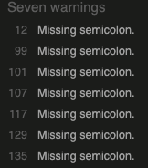
	-	Fix: The JS warning indicates that there 7 semicolons' missing from the JS file. I was able to navigate to the warnings and place semicolons appropriately.
-	[Chrome DevTools](https://developers.google.com/web/tools/chrome-devtools)
	-	I have used  DevTools to test the styling and responsiveness of the website on the different devices-Mobile, Tablet and Desktop.
-	[ResponsivelyApp](https://responsively.app/) 
	-	This desktop application was used to preview all target screens in a single window side-by-side. I found this to be very useful as I don't have to navigate through different devices to view responsiveness. 
	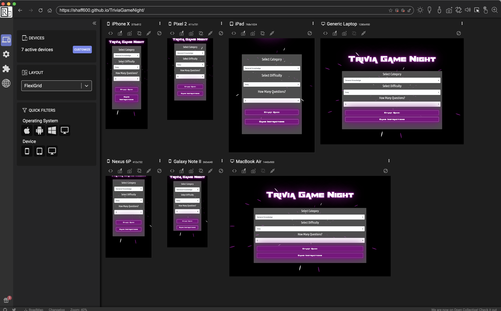
	

## Testing User Stories from User Experience (UX) Section

1. As a user, I would like to read instructions for the quiz.
	- User can select "Game Instructions" and view instructions.
2. As a user, I would like to select a topic that I'm interested in
	- Under "Select Category" the user can select 9 different quiz topics.	
	- When starting a quiz, question topics are correct.
3.  As a user, I would like to select the number of questions that I want .
	- The user can select either 5, 10 or 15 from the drop-down menu.
	- The API generates the specified volume of questions. 	
4.  As a user, I'd like some control over the quiz difficulty level.
	- Under "Select Difficulty" the user can select easy, medium or hard.
	- API generates appropriate difficulty for question-level selected.
5. Once the game has started, I would like each question to be different 
	- No duplicates were populated at the time of testing.
6. Upon selecting an answer I would like to know if I was correct/incorrect
	- When the user selects an answer a modal is populated informing of correct/incorrect answer.
7.  At the end of the game, I would like to know my score and given the option to return to the game menu page.	
	- User is promoted a total amount of correct/incorrect answers when the quantity of questions is reached.
8. As a user, I'd like to be able to play the game on various screen sizes.
	- User can navigate and interact with the quiz on all popular devices.

  ## Manual Testing 
    
  ### API Data - Category 
   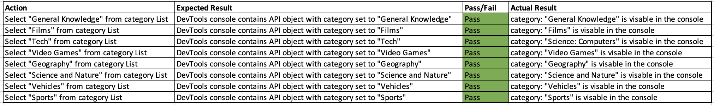

### API Data - Difficulty
   

### API Data - Number of Question 
   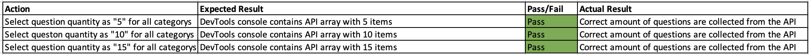

### Modal
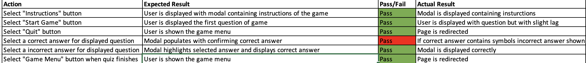

### Known Bugs
During the process of manually testing the application, I have come across an issue where the correct answer is portrayed to be incorrect as it holds special symbols such as apostrophe. The issue can be seen below: 
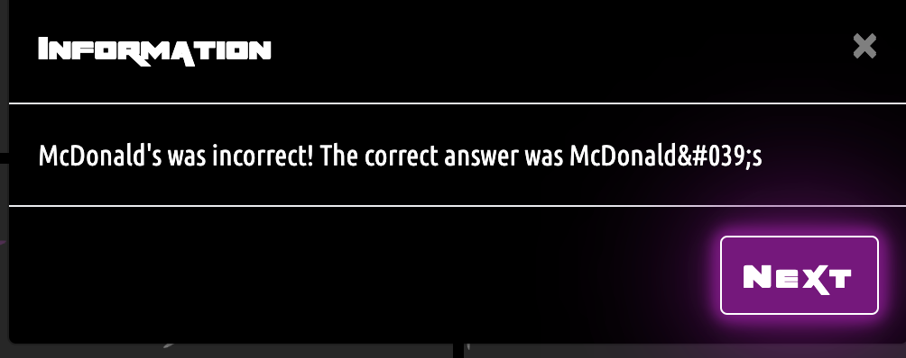

### Issues Faced
During the process of selecting categories for the quiz, I had to ensure that each category has enough questions to meet the user's selection. The Trivia Open DB contains a category called "Celebrities". When testing against the volume of question the category produces for difficulty level "easy", it was identified that it can only output a maximum of 10 questions. Therefore, if a user selects a quantity of 15 in the quiz "Celebrities" category, the API would return a response code as "No Results". Below demonstrates how I went about testing this:

### Step 1:
 - Generate API key with 15 questions, category as "Celebrities",   
   the difficulty as "Easy", select type as "Multiple Choice".
   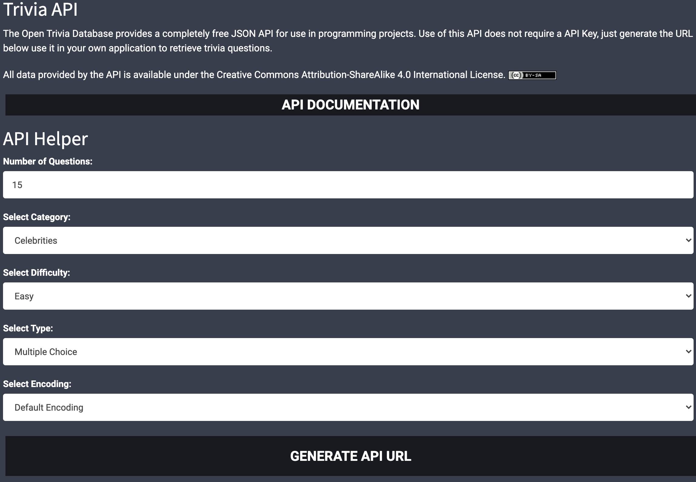

### Step 2:
- Copy generated API URL.
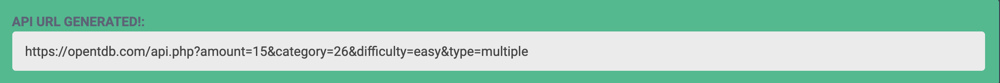
### Step 3:
-	Download and open [Postman](https://www.postman.com/).
	-	Postman allows you to explore the API by sending it different kinds of data to see what values are returned. I've used this tool against the API URL to visually see the response given from the API.
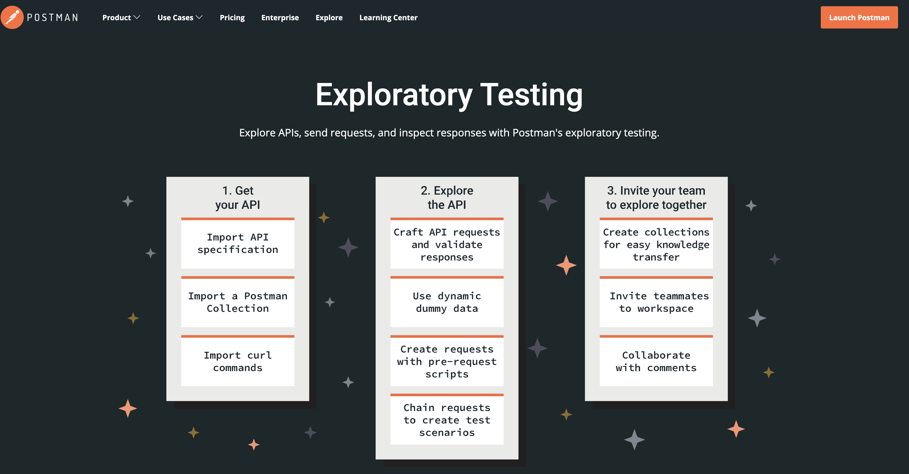
### Step 4:
-	Insert URL as a GET Request. The below displays the response code given for the API URL.
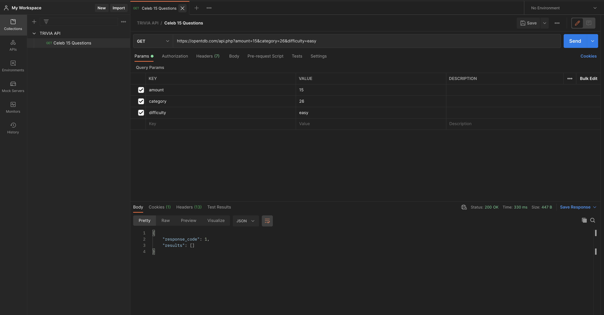
### Step 5:
-	When reffering back to the API documentation it suggests that "Code 1: **No Results** Could not return results. The API doesn't have enough questions for your query."
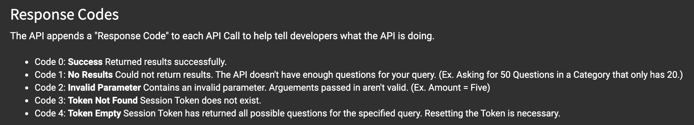

### Future Development 
-	Due to time constraints I was not able to include a timer within the quiz. Ideally, I would link the timer to the difficulty level so it makes the quiz more challenging for the user. I've come across a tutorial from Steve Griffith on  [YouTube](https://www.youtube.com/watch?v=0VVJSvlUgtg) which may help me acheive this.
-	To further develop the quiz experience I would like to add background music to the project. I would like to have 3 different sounds included, 1 for the background for the quiz, another 1 for getting the answer correct and another 1 for an incorrect answer. This can be achieved by including something like this from [w3schools](https://www.w3schools.com/graphics/game_sound.asp).
-	Currently, the quiz displays a modal to show incorrect/correct answers however I would change this so that the correct answer box is highlighted in green and incorrect answer boxes are highlighted in red. This would make the quiz more smoother to play as the user doesn't have to close down the modal to show the next question.


## Deployment

### GitHub Pages

The project was deployed to GitHub Pages using the following steps...

1. Log in to GitHub and locate the [GitHub Repository](https://github.com/shaff600/TriviaGameNight)
2. At the top of the Repository (not top of page), locate the "Settings" Button on the menu.
3. Scroll down the Settings page until you locate the "GitHub Pages" Section.
4. Under "Source", click the dropdown called "None" and select "Master Branch".
5. The page will automatically refresh.
6. Scroll back down through the page to locate the now published site [link](https://shaff600.github.io/TriviaGameNight/) in the "GitHub Pages" section.

### Forking the GitHub Repository

By forking the GitHub Repository we make a copy of the original repository on our GitHub account to view and/or make changes without affecting the original repository by using the following steps...

1. Log in to GitHub and locate the [GitHub Repository](https://github.com/shaff600/TriviaGameNight)
2. At the top of the Repository (not top of page) just above the "Settings" Button on the menu, locate the "Fork" Button.
3. You should now have a copy of the original repository in your GitHub account.

### Making a Local Clone

1. Log in to GitHub and locate the [GitHub Repository](https://github.com/shaff600/TriviaGameNight)
2. Under the repository name, click "Clone or download".
3. To clone the repository using HTTPS, under "Clone with HTTPS", copy the link.
4. Open Git Bash
5. Change the current working directory to the location where you want the cloned directory to be made.
6. Type `git clone`, and then paste the URL you copied in Step 3.

```
$ git clone https://github.com/shaff600/TriviaGameNight
```

7. Press Enter. Your local clone will be created.

```
$ git clone https://github.com/shaff600/TriviaGameNight
> Cloning into `CI-Clone`...
> remote: Counting objects: 10, done.
> remote: Compressing objects: 100% (8/8), done.
> remove: Total 10 (delta 1), reused 10 (delta 1)
> Unpacking objects: 100% (10/10), done .
```

Click [Here](https://help.github.com/en/github/creating-cloning-and-archiving-repositories/cloning-a-repository#cloning-a-repository-to-github-desktop) to retrieve pictures for some of the buttons and more detailed explanations of the above process.

## Credits

### Sources 
- Prior to the development of the project I was conducting research on how I would go about the project. I came across a series on [YouTube](https://www.youtube.com/watch?v=u98ROZjBWy8&list=PLDlWc9AfQBfZIkdVaOQXi1tizJeNJipEx) by James Quick which helped plan out the different concepts to include in the project.
-	In order to get a glow effect on the title I utilized the below code from [Code Pen](https://codepen.io/AllThingsSmitty/pen/VzXrgY).  I would like to thank Matt Smith for sharing this piece of code with the community.
-	I have included a transparent DIV on the game menu and main quiz page to allow written content to be readable for users. In order to do this, I followed a [YouTube](https://www.youtube.com/watch?v=TUAB2J8R4Rw) video to do this.
-	When going about installing custom fonts into the project this article on [CSS Tricks](https://css-tricks.com/snippets/css/using-font-face/) helped with clarifying steps to achieve this.
### Acknowledgements
- I would like to thank the CI tutors for supporting me through issues faced on the project and sharing different troubleshooting options which I've not previously used.
- Prior to the development of the project the channel lead for Interactive FrontEnd, Aukje, provided a very helpful live coding session going through how to connect to an API. I would like to thanks to Aukje for her efforts on this call as it allowed me to iron out concerns before starting the development of the project.
- During the development process I was able to receive feedback from my mentor Aaron Sinnott of who provided recommendations on the project and documentation. I would like to thank him also for all the encouragement and support.


