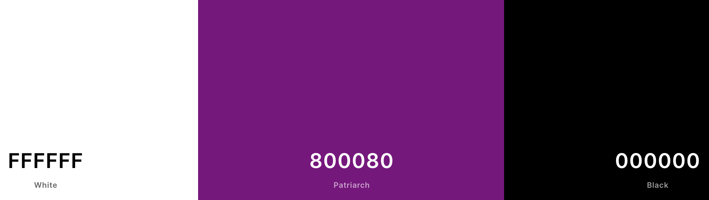
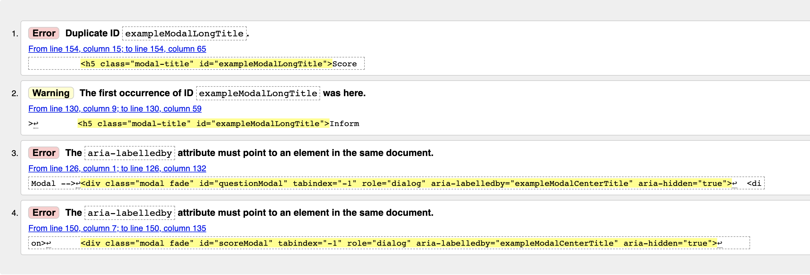
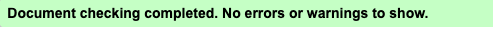
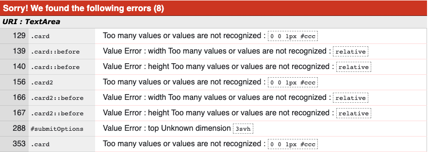
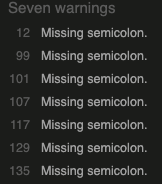
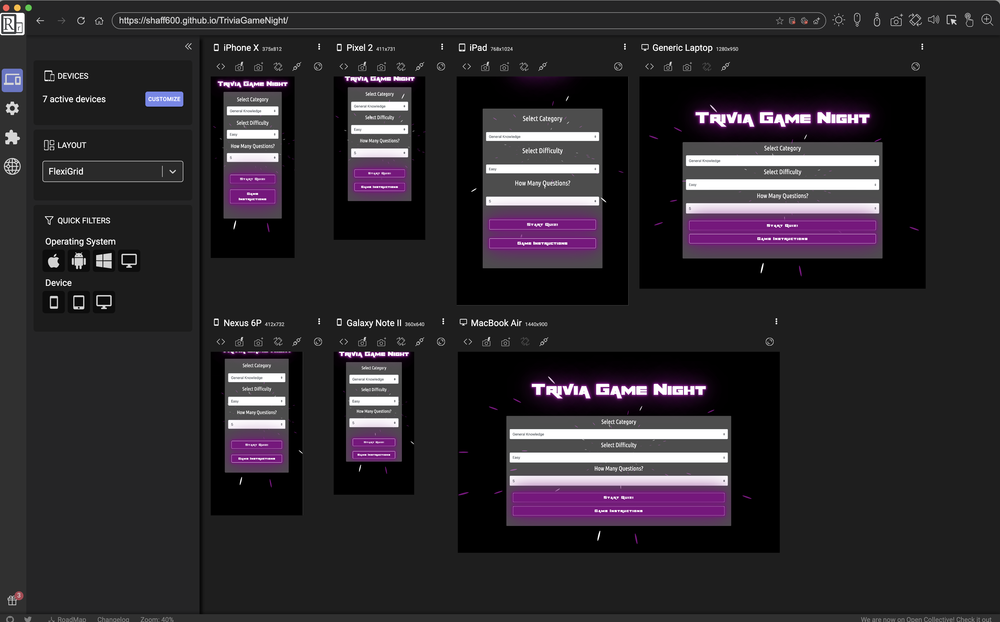
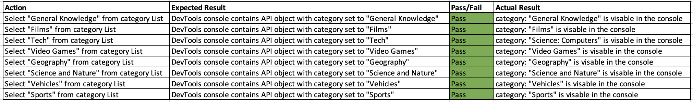

<h1 align="center">Trivia Game Night</h1>
	- This project is based of the Trivia Open DB.
	
# Table of Contents

* [Purpose](#purpose)
*  [User Experience](#user-experience-ux)
* [Features](#features )
*  [Technologies Used](#technologies-used)
*  [Testing](#testing)
* [Issues Faced](#issues-faced)
* [Known Bugs](#known-bugs)
*  [Future Development](#future-development)
* [Deployment](#deployment)
* [Credits](#credits)

## Purpose 
- A Trivia quiz contains questions about interesting but unimportant questions across many topics. A Trivia Quiz is usually held within social areas such as pub's and bingo halls. This quiz has been desinged to bring the same interesting but unimportant questions. The development of this project is for users who would like to test their knowledge across different topics. 

# User Experience (UX)
## Stratergy: 
This project was developed for users to challange their knowledge in an interactive way. The quizzes importance lies in the fact that it is appropriate for people of all ages and has a wide range of categories to satisfy any user. It also has a range of difficulty levels for those who are more experienced and want to push themselves, as well as, having easier quiz questions for topics you've not delved into before.

The project is based of the [Open Trivia Database](https://opentdb.com/) which essentially is a free to use, user-contributed trivia question database. The Open Trivia Database provides a completely free JSON API to use in programming projects. The use of this API does not require a API Key.

The objective is to provide users with a fun, interactive trivia game based on their favourite categories. Although the game is appropriate for people of all ages, the interface must be visually pleasing in order to boost user engagement and acceptability across different age groups

-	### User stories
	- As a user, I would like to read insturctions for the quiz
	-   As a user, I would like to select a a topic that I'm intersted in
	-  As a user, I would like to select the number of questions that I want 
	-   As an user, I'd like some control over the quiz difficulty level
	- Once game has started, I would like each question to be different 
	- Upon selecting an answer I would like to know if I was correct/incorrect
	- At the end of the game, I would like to know my score and given the option to return to game menu page	
	- As a user, I'd like to be able to play the game on various screen sizes.
	
## Scope:
The quiz pulls data from the Trivia DB using an API. As the API provides over 20 quiz categories, I've amended the list to include a 9 popular topics. There where two options for the formatting the quiz, multiple choice or true/false. I decided to go with multiple choice as I believe it would be more of a viable project to do as there is more development needed. The API can generate a maximum of 50 questions for a given category, I have limited the volume of questions to either 5, 10 and 15.

## Structure:
The **First Section-** Contains the , 3 dropdown options **Category**, **Difficulty** and **Number of questions** and two buttons, one to start the game and another detailing instructions.
The **Second Section-** Contains the questions and potential answers, that are pulled from the API,  section detailing incorrect/correct answers and a quit button.  
The **Third Section-** Contains the Game Over modal, that will display the user's total score and a home button.
## Skeleton:
 Prior to the development of the project I scetched out in Balsamiq Wireframes to provide an inital idea of how I would display content. My inital wireframe included a timer and progress bar of which I did not implement. The reason for this is that I decided to either display incorrect/correct answers as  values rather then implmenting a visual bar to display progress. A timer was not included due to time limitations, however this is something I have included in [Future Development](#future-development). Find below PDF copies of wireframes below
   -   Pre-development Wireframe - [View](https://github.com/shaff600/TriviaGameNight/blob/master/assets/docs/MS2.pdf)
    -   Post-development Wireframe - [View](https://github.com/shaff600/TriviaGameNight/blob/master/assets/docs/MS2_wireframe%202.pdf)
 ## Surface:
My initial thoughts when designing the surface of the website was to theme the quiz to match an arcade type game. This meant including live backgrounds, funky fonts and a qwerky color scheme. Here is show i went about acheiving this: 
### Live background - [Loading.io](https://loading.io/background/m-interstellar/)
-	The live background was implemented into the site by using an SVG file. By including this, the website can be seen as being an arcade themed as the background is popular for 80's arcade games. 
### Custom Font - [Font Space](https://www.fontspace.com/rapier-zero-font-f18156)
- To suit the 80's arcade theme, i believe this font provides a "loud" styling which suits the theme of the quiz.
### Font Glow - [Code Pen](https://codepen.io/AllThingsSmitty/pen/VzXrgY)
- To exaggerate the "loud" styling, I have also included a glow to the font. the above snippet was used to implement this effect

### Colour Palette - [Coolors Palette](https://coolors.co/ffffff-800080-000000)
-	Prior to applying a colour scheme to the project, I created a palette on the above site to figure out if the colours will work together.



## Features

-   Responsive on all device sizes

-   Trivia API
- Progress Bar
- Animation at End of Game
- Score System

## Technologies Used

### Languages Used

-   [HTML5](https://en.wikipedia.org/wiki/HTML5)
-   [CSS3](https://en.wikipedia.org/wiki/Cascading_Style_Sheets)

### Frameworks, Libraries & Programs Used

1. [Bootstrap 4.4.1:](https://getbootstrap.com/docs/4.4/getting-started/introduction/)
    - Bootstrap was used to assist with the responsiveness and styling of the website.

1. [Google Fonts:](https://fonts.google.com/)
    - Google fonts were used to import the 'Titillium Web' font into the style.css file which is used on all pages throughout the project.
1. [Font Awesome:](https://fontawesome.com/)
    - Font Awesome was used on all pages throughout the website to add icons for aesthetic and UX purposes.
1. [jQuery:](https://jquery.com/)
    - jQuery came with Bootstrap to make the navbar responsive but was also used for the smooth scroll function in JavaScript.
1. [Git](https://git-scm.com/)
    - Git was used for version control by utilizing the Gitpod terminal to commit to Git and Push to GitHub.
1. [GitHub:](https://github.com/)
    - GitHub is used to store the projects code after being pushed from Git.

1. [Balsamiq:](https://balsamiq.com/)
    - Balsamiq was used to create the [wireframes](https://github.com/) during the design process.

# Testing

The W3C Markup Validator and W3C CSS Validator Services and JSLint were used to validate every page of the project to ensure there were no syntax errors in the project.
	
- [W3C HTML Validator](https://validator.w3.org/)
- When running my index.html file through the validator there where 4 errors which where outputted. As seen here:

	-	Fix: There where two  error/warning relating to duplication of ID's. This was rectified by removing the ID's entirely. Furthermore, the "aria-labelledby" was removed as it is not needed. Both issues where caused by inserting code from the Bootstrap Docs and not removing elements that aren't needed. 

-	 [W3C CSS Validator](https://jigsaw.w3.org/css-validator/)
	-	The validator produced 8 errors, 7 are related to the transparent background and 1 is related to a typo. Error's can be seen here: 

		-	Fix: I've removed th values that was causing issues. The transparency background was developed using a tutorial that was found on YouTube. Similarly to the HTML errors, I was inserting unnecessary code that was not needed.

-	[JSLint](https://jshint.com/)
-	JSLint is a static code analysis tool used in software development for checking if JavaScript source code complies with coding rules. 
	
	-	Fix: The JS warning indicate that there 7 semicolon's missing missing from the JS file. I was able to navigate to the warnings and place semicolon's appropriately.
-	[Chrome DevTools](https://developers.google.com/web/tools/chrome-devtools)
	-	I have used  DevTools test the styling and responsiveness of the website on the different devices-Mobile, Tablet and Desktop.
-	[ResponsivelyApp](https://responsively.app/) 
	-	This desktop application was used to preview all target screens in a single window side-by-side. I found this to be very usefull as I dont have to navigate through different devices to view responsiveness. 
	
	

## Testing User Stories from User Experience (UX) Section

1. As a user, I would like to read insturctions for the quiz
		- User can select "Game Instructions" and view instructions.
2. As a user, I would like to select a a topic that I'm intersted in
		- Under "Select Category" the user can select 7 different quiz topics.	
		- When starting quiz, question topics are correct.
3.  As a user, I would like to select the number of questions that I want 
		- The user can select either 5, 10 or 15 from drop down menu.
		- The API generates the specified volume of questions. 	
4.  As an user, I'd like some control over the quiz difficulty level
		- Under "Select Difficulty" the user can select easy, medium or hard.
		- API generates appropriate difficulty for question level selected.
5. Once game has started, I would like each question to be different 
		- No duplicates where populated at time of testing.
6. Upon selecting an answer I would like to know if I was correct/incorrect
		- When user selects an answer a modal is populated informing of correct/incorrect  answer.
7.  At the end of the game, I would like to know my score and given the option to return to game menu page	
	- User is promoted a total amount of correct/incorrect answers when quantity of questions is reached.
8. As a user, I'd like to be able to play the game on various screen sizes.
	- User can navigate and interact with quiz on all popular devices.

    ## Manual Testing 
    ### API Data - Category 
    

### API Data - Difficulty

### API Data - Number of Question 

### Issues Faced

### Known Bugs

### Future Development 

## Deployment

### GitHub Pages

The project was deployed to GitHub Pages using the following steps...

1. Log in to GitHub and locate the [GitHub Repository](https://github.com/)
2. At the top of the Repository (not top of page), locate the "Settings" Button on the menu.
    - Alternatively Click [Here](https://raw.githubusercontent.com/) for a GIF demonstrating the process starting from Step 2.
3. Scroll down the Settings page until you locate the "GitHub Pages" Section.
4. Under "Source", click the dropdown called "None" and select "Master Branch".
5. The page will automatically refresh.
6. Scroll back down through the page to locate the now published site [link](https://github.com) in the "GitHub Pages" section.

### Forking the GitHub Repository

By forking the GitHub Repository we make a copy of the original repository on our GitHub account to view and/or make changes without affecting the original repository by using the following steps...

1. Log in to GitHub and locate the [GitHub Repository](https://github.com/)
2. At the top of the Repository (not top of page) just above the "Settings" Button on the menu, locate the "Fork" Button.
3. You should now have a copy of the original repository in your GitHub account.

### Making a Local Clone

1. Log in to GitHub and locate the [GitHub Repository](https://github.com/)
2. Under the repository name, click "Clone or download".
3. To clone the repository using HTTPS, under "Clone with HTTPS", copy the link.
4. Open Git Bash
5. Change the current working directory to the location where you want the cloned directory to be made.
6. Type `git clone`, and then paste the URL you copied in Step 3.

```
$ git clone https://github.com/YOUR-USERNAME/YOUR-REPOSITORY
```

7. Press Enter. Your local clone will be created.

```
$ git clone https://github.com/YOUR-USERNAME/YOUR-REPOSITORY
> Cloning into `CI-Clone`...
> remote: Counting objects: 10, done.
> remote: Compressing objects: 100% (8/8), done.
> remove: Total 10 (delta 1), reused 10 (delta 1)
> Unpacking objects: 100% (10/10), done .
```

Click [Here](https://help.github.com/en/github/creating-cloning-and-archiving-repositories/cloning-a-repository#cloning-a-repository-to-github-desktop) to retrieve pictures for some of the buttons and more detailed explanations of the above process.

## Credits

### Code


### Content


### Media


### Acknowledgements
